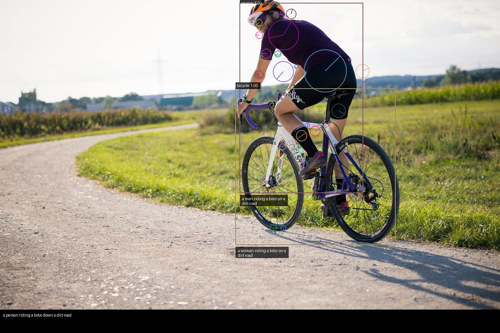

# Scene Recognition and Automatic Labeling

### Multimodal Vision Pipelines for Images & Videos

This project implements a **modular multimodal computer vision framework** for **scene recognition and automatic labeling** from **images and videos**.
It integrates **object detection, keypoint extraction, optical flow, action inference, and vision–language captioning** into a single interpretable pipeline.

The system produces:

* Annotated images (bounding boxes, keypoints, motion cues)
* Per-object and global natural-language captions
* Frame-wise annotated video outputs (optional)

---

## 🔍 Overview

**Pipeline stages**

1. **Object Detection** – Detects objects with confidence filtering
2. **Keypoint Extraction** – Classical feature extraction (SIFT / ORB)
3. **Optical Flow (Optional)** – Motion estimation from frame pairs
4. **Action Inference** – Rule-based reasoning using IoU + motion cues
5. **Caption Generation** – Global & object-level captions using BLIP
6. **Visualization** – Unified annotated output

This hybrid design combines **classical vision** and **deep learning**, keeping the system **interpretable and extensible**.

---

## 📁 Project Structure

```text
Scene-Recognition-And-Automatic-Labeling/
│
├── data/                     # Input images / video frames
│   ├── image4.jpg
│   ├── frame_000.jpg
│   └── frame_001.jpg
│
├── output/                   # Generated results
│   └── annotated.jpg
│
├── src/                       # Core vision modules
│   ├── detect.py              # Object detection (Mask R-CNN wrapper)
│   ├── features.py            # Keypoint extraction (SIFT / ORB)
│   ├── flow.py                # Dense optical flow (Farneback)
│   ├── actions.py             # Action inference (IoU + motion rules)
│   ├── caption.py             # BLIP-based caption generation
│   ├── viz.py                 # Annotation & visualization utilities
│   └── __init__.py
│
├── run_test.py                # Main driver script
├── WRITE-UP.pdf               # Project report / methodology
└── README.md
```

---

## ▶️ How the Pipeline Works

```text
Input Image / Frames
        ↓
Object Detection (Mask R-CNN)
        ↓
Keypoint Extraction (SIFT / ORB)
        ↓
Optical Flow (if frame pair available)
        ↓
Action Inference (heuristic rules)
        ↓
Caption Generation (BLIP)
        ↓
Annotated Output (Image / Video)
```

---

## 🚀 Running the Project

### 1️⃣ Create a Virtual Environment (Recommended)

```bash
python -m venv venv
```

Activate it:

**Windows**

```bash
venv\Scripts\activate
```

**Linux / macOS**

```bash
source venv/bin/activate
```

---

### 2️⃣ Install Dependencies

```bash
pip install -r requirements.txt
```

(If `requirements.txt` is not created yet, install manually:
`torch`, `torchvision`, `opencv-python`, `Pillow`, `matplotlib`, `transformers`)

---

### 3️⃣ Run the Demo Script

```bash
python run_test.py
```

What it does:

* Loads input image from `data/`
* Runs all vision modules from `src/`
* Generates captions and annotations
* Saves output to `output/annotated.jpg`

---

## 📊 Output Examples

### 🖼️ Image Output

> *(Paste your annotated image here)*

```markdown

```

---

### 🎥 Video Output

For videos, the pipeline processes **each frame independently** and saves annotated frames.

> *(Paste your video demo or GIF here)*

```markdown

```

*(Full videos are not embedded due to size constraints.)*

---

## 📓 Jupyter Notebook Support (VS Code)

### Install Jupyter Kernel Inside venv

```bash
pip install ipykernel
```

Register the virtual environment as a kernel:

```bash
python -m ipykernel install --user --name scene-vision-venv --display-name "SceneVision (venv)"
```

### Use in VS Code

1. Open a `.ipynb` file
2. Click **Select Kernel**
3. Choose **SceneVision (venv)**

This ensures notebooks use the **same environment as the project**.

---

## 🧠 Key Design Choices

* **Hybrid approach**: Classical vision + deep learning
* **Interpretability**: Explicit action rules instead of black-box HOI
* **Modularity**: Each vision task isolated in `src/`
* **Extensibility**:

  * Replace heuristics with learned HOI models
  * Swap BLIP with other vision–language models
  * Extend to temporal video captioning

---

## ⚠️ Known Limitations

* Small objects may be missed at higher detection thresholds
* Optical flow can be unstable in low-texture regions
* Action inference is heuristic-based (rule-driven)
* Video processing generates large numbers of annotated frames

---

## 📄 Reference

For full methodology, experiments, and analysis, see:

**`WRITE-UP.pdf`** – *Scene Recognition and Automatic Labeling from Images Using Multimodal Vision Pipelines*

---

## 👤 Author

**Bhaskar R**
Computer Vision & Multimodal AI
*(Academic project – EE604 / Image Processing)*
